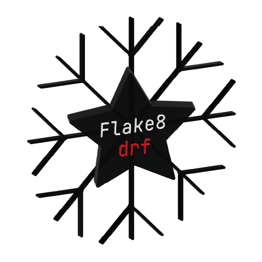

<p align="center">
  
</p>

<h1 align="center">
 flake8-drf
</h1>
<p align="center">
    Flake8 plugin for django-rest-framework
</p>

# flake8-drf

Flake8 plugin that detects some issues with your drf code.
Work in progress. Currently detects places where you should use drf status constants.

## Installation

```console
pip install flake8-drf
```


## Usage
Let's say we have the following code below:

```python
from rest_framework import views
from rest_framework.views import Response, APIView


class AuthView(APIView):

    def get(self, request):
        return Response(status=200)


class PostsView(views.APIView, APIView):

    def post(self, request):
        return Response(status=201)
```

Running flake8 with the plugin will tell the following:
```console
main.py:8:25: DRF0 Status code can be changed to constant: HTTP_200_OK
main.py:14:25: DRF0 Status code can be changed to constant: HTTP_201_CREATED
```
